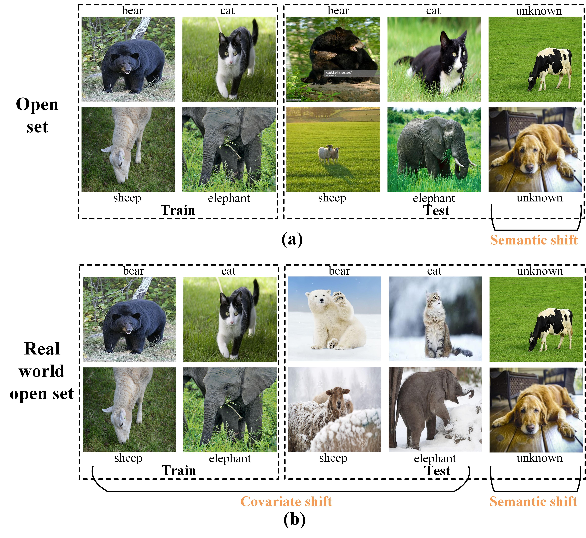

# CIOSR
Causal Inference-inspired Open Set Recognition.

This is a description of the source code for "Open Set Recognition in Real World".




## Introduction
1. A new open-set recognition task, RWOSR, was introduced for the purpose of
addressing open-set recognition challenges in the real world.
2. A novel Causal Inference-inspired OSR (CIOSR) method has been proposed to
address the problem of OSR in real-world scenarios. With our proposed method, we
have successfully tackled the challenges of both covariate shift and semantic shift in
RWOSR, thereby enhancing the feasibility of applying OSR in real-world settings.

## Installation
### Requirements
- Linux with Python >= 3.6
- [PyTorch](https://pytorch.org/) >= 1.1.0
- torchvision >= 0.3.0
- tensorboard >= 1.14.0

## Quick Start
### Data
The data should be placed in `Data/`. Train data is `Data/Train/`. Test data is `Data/Test/`. Unknown classes is `Data/Unknown/`.

Note: Train data and test data should not come from the same distribution, meaning that the distribution of train data is different from that of test data, but the categories are the same. `Data/Unknown/` is new/unknown category data.
### Train CIOSR
```bash
python RWOSR_train --gpu 0
```
### Test CIOSR


```bash
python OSR1 --gpu 0
```
Result files will be saved in `results/`.

The training and testing settings of CIOSR are displayed in 
```bash
ops/config.py
```

The trained models can be  obtained in [CIOSR-Resnet18](https://drive.google.com/file/d/1Pg7DqU05C4QvfhobDkmyTE-tUXibcIsm/view?usp=drive_link),[CIOSR-Resnet50](https://drive.google.com/file/d/165YRtsXv8dEsp7o7pgbN5qNBKKZu94Lr/view?usp=drive_link),[CIOSR-Resnet34](https://drive.google.com/file/d/1r1oKeP9qBDYLpELFrAX5MskSe9PZncL6/view?usp=drive_link).


## Acknowledgement
[StableNet](https://github.com/xxgege/StableNet), [UOSR](https://github.com/Jun-CEN/Unified_Open_Set_Recognition), [DIAS](https://github.com/wjun0830/Difficulty-Aware-Simulator),[OpenAUC](https://github.com/wang22ti/OpenAUC), [ARPL](https://github.com/iCGY96/ARPL), [OLTR](https://github.com/zhmiao/OpenLongTailRecognition-OLTR)